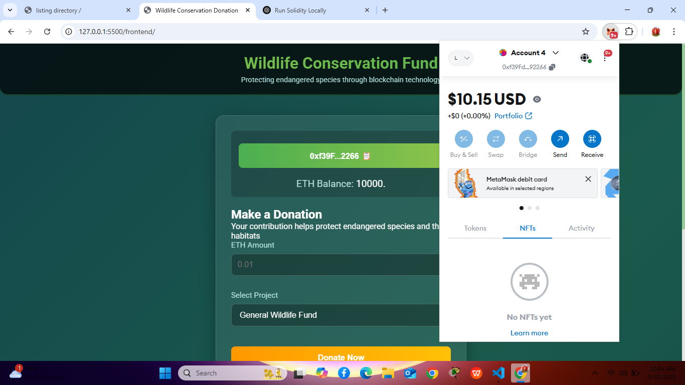
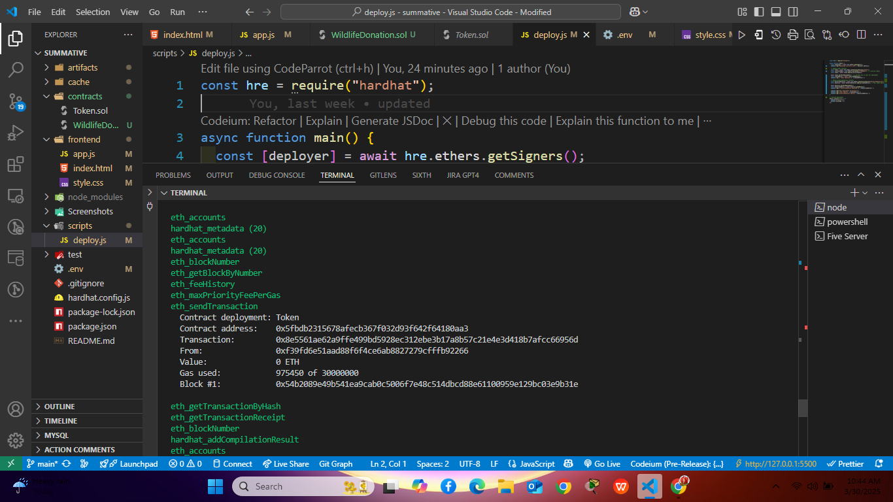
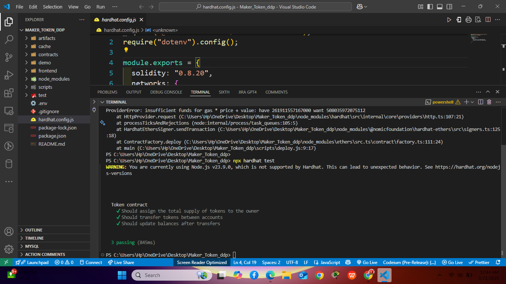

# Blockchain-Based-Tokenization-Wildlife-Conservation

A simple decentralized application (DApp) that allows users to transfer custom ERC-20 tokens between Ethereum accounts via a web interface.
# CRUD OPERATION

## 🔧 Features
1️⃣ 🔗 Transparent Token-Based Donations

Users donate using ERC-20 tokens instead of traditional currency.

Transactions are recorded on-chain, ensuring full transparency.

Smart contracts handle donations securely and automatically.

2️⃣ 📊 Real-Time Tracking of Donations & Impact

Displays total funds donated and number of species protected.

Every donation updates the live statistics in the smart contract.

Prevents fraud by allowing anyone to verify transactions on Ethereum.

3️⃣ 🦏 Conservation Impact Monitoring

Admins (conservation organizations) can update the species protected count.

Donors can see how their contributions are making a real impact.

Encourages trust and accountability in wildlife conservation efforts.

4️⃣ 💳 Secure & Decentralized Transactions

Uses Ethereum’s blockchain for fast, secure, and permissionless transactions.

Eliminates the need for middlemen, reducing operational costs.

Supports crypto wallets (e.g., MetaMask) for seamless interactions.

## 📸 Screenshots

### Frontend  

### Connect Wallet  

### Test

## 🛠 Tech Stack
- Solidity
- HTML/CSS
- JavaScript
- Web3.js
- MetaMask
- Remix IDE

## 📄 Smart Contract Overview

- Token Name: MyToken
- Symbol: MTK
- Initial Supply: 1,000,000 MTK

### Contract Functions
🔹 1️⃣ Token Functions (Token.sol)
Your ERC-20 token (e.g., MTK) represents donation currency.

✅ constructor(uint256 initialSupply)
Purpose: Mints initialSupply of tokens to the deployer.

Token token = new Token(1000000); // Creates 1M MTK tokens
✅ transfer(address recipient, uint256 amount)
Purpose: Allows users to send tokens to others.

token.transfer(userAddress, 1000); // Sends 1000 MTK
✅ approve(address spender, uint256 amount)
Purpose: Allows a spender (WildlifeDonation contract) to use tokens on the owner's behalf.

token.approve(donationContract, 500);
✅ transferFrom(address sender, address recipient, uint256 amount)
Purpose: Transfers tokens from a user to another if approved.

token.transferFrom(user, donationContract, 500); // Transfers 500 MTK
🔹 2️⃣ Wildlife Donation Functions (WildlifeDonation.sol)
This contract handles donations and tracking conservation efforts.

✅ constructor(address _tokenAddress)
Purpose: Sets the ERC-20 token used for donations.

WildlifeDonation donation = new WildlifeDonation(tokenAddress);
✅ donate(uint256 _amount)
Purpose: Users donate tokens to wildlife conservation.

Requires:

The user must have approved the donation contract to use their tokens.

donation.donate(500); // Donates 500 MTK
Effects:

Transfers tokens from user → contract

Increases totalDonated

✅ totalDonated() (View Function)
Purpose: Returns the total amount of tokens donated.

uint256 donated = donation.totalDonated();
✅ updateSpeciesProtected(uint256 _newCount) (Only Owner)
Purpose: Updates the number of protected species.

Requires:

Only the owner (deployer) can call this.

donation.updateSpeciesProtected(25);
Effects:

Updates speciesProtected count.

✅ speciesProtected() (View Function)
Purpose: Returns the number of species protected.

uint256 species = donation.speciesProtected();
🔹 3️⃣ Frontend/Web3 Interactions
Your app will likely have a frontend that interacts with these functions.

💰 User Buys Tokens
Users connect their wallet (MetaMask)

They receive MTK tokens for making donations.

🦏 User Donates Tokens
Calls approve(donationContract, amount)

Calls donate(amount)

📊 View Total Donations
Calls totalDonated()

Displays total funds raised

🌱 Admin Updates Species Count
Calls updateSpeciesProtected(newCount)


## 📦 Installation & Usage

This guide will help you **set up, deploy, and test** your Ethereum-based donation system using Hardhat.  

---

## **1️⃣ Install Prerequisites**  
Before starting, make sure you have these installed:

✅ **Node.js** (Recommended: **v18** or **LTS version**)  
```sh
node -v
```
❌ If not installed, download it from [Node.js official website](https://nodejs.org/).  

✅ **Hardhat & Dependencies**  
Run:
```sh
npm install -g hardhat
```
## **Create a Hardhat Project**
Open a terminal and **create a new project**:
```sh
mkdir wildlife-donation
cd wildlife-donation
```

**Initialize Hardhat**:
```sh
npx hardhat
```
- Select **"Create a basic sample project"**
- Choose **"Yes"** when asked to install dependencies  
- It will create a folder structure like:
  ```
  wildlife-donation/
  ├── contracts/
  ├── scripts/
  ├── test/
  ├── hardhat.config.js
  ├── package.json
  ├── node_modules/
  ```

## **Install Required Dependencies**
```sh
npm install @openzeppelin/contracts hardhat-ethers ethers dotenv chai
```
- **@openzeppelin/contracts** → Secure ERC-20 token implementation  
- **hardhat-ethers & ethers.js** → Interacting with Ethereum  
- **dotenv** → Store environment variables  
- **chai** → Testing framework  

## **Add Smart Contracts**
Place your **Solidity contracts** inside the `/contracts/` folder.

### **🟢 `Token.sol` (ERC-20 Token)**
Create a file:  
📂 `contracts/Token.sol`
```solidity
// SPDX-License-Identifier: MIT
pragma solidity ^0.8.20;

import "@openzeppelin/contracts/token/ERC20/ERC20.sol";

contract Token is ERC20 {
    constructor(uint256 initialSupply) ERC20("MyToken", "MTK") {
        _mint(msg.sender, initialSupply * (10 ** uint256(decimals())));
    }
}
```
### **🟢 `WildlifeDonation.sol` (Donation Contract)**
Create a file:  
📂 `contracts/WildlifeDonation.sol`
```solidity
// SPDX-License-Identifier: MIT
pragma solidity ^0.8.20;

import "@openzeppelin/contracts/token/ERC20/IERC20.sol";

contract WildlifeDonation {
    IERC20 public token;
    address public owner;
    uint256 public totalDonated;
    uint256 public speciesProtected;

    event DonationReceived(address indexed donor, uint256 amount);
    event SpeciesProtectedUpdated(uint256 newCount);

    constructor(address _tokenAddress) {
        token = IERC20(_tokenAddress);
        owner = msg.sender;
    }

    function donate(uint256 _amount) external {
        require(_amount > 0, "Donation amount must be greater than zero");
        require(token.transferFrom(msg.sender, address(this), _amount), "Transfer failed");

        totalDonated += _amount;
        emit DonationReceived(msg.sender, _amount);
    }

    function updateSpeciesProtected(uint256 _newCount) external {
        require(msg.sender == owner, "Only the owner can update species count");
        speciesProtected = _newCount;
        emit SpeciesProtectedUpdated(_newCount);
    }
}

## **Configure Hardhat**
 **`hardhat.config.js`**
  `ethers.js`:
```javascript
require("@nomicfoundation/hardhat-ethers");

module.exports = {
  solidity: "0.8.20",
  networks: {
    localhost: {
      url: "http://127.0.0.1:8545",
    },
  },
};
```
## **Deploy Your Contracts**
Create a new file:  
📂 `scripts/deploy.js`
```javascript
const hre = require("hardhat");

async function main() {
  const [deployer] = await hre.ethers.getSigners();
  console.log("Deploying contracts with:", deployer.address);

  // Deploy ERC-20 Token
  const Token = await hre.ethers.getContractFactory("Token");
  const initialSupply = hre.ethers.parseEther("1000000");
  const token = await Token.deploy(initialSupply);

  await token.waitForDeployment();
  const tokenAddress = await token.getAddress();
  console.log(`✅ Token deployed to: ${tokenAddress}`);

  // Deploy WildlifeDonation Contract
  const WildlifeDonation = await hre.ethers.getContractFactory("WildlifeDonation");
  const donation = await WildlifeDonation.deploy(tokenAddress);

  await donation.waitForDeployment();
  console.log(`✅ WildlifeDonation deployed to: ${await donation.getAddress()}`);
}

main().catch((error) => {
  console.error(error);
  process.exitCode = 1;
});
```
## **Run Local Ethereum Blockchain**
Start Hardhat’s built-in blockchain:  
```sh
npx hardhat node
```
✅ This launches a **local Ethereum network** at `http://127.0.0.1:8545/`.  
✅ It pre-funds **test accounts** with ETH.

## **Deploy Contracts to Local Network**
In a **new terminal**, deploy the contracts:  
```sh
npx hardhat run scripts/deploy.js --network localhost
```
✅ Expected Output:
```
Deploying contracts with: 0xYourAccountAddress
✅ Token deployed to: 0xTokenContractAddress
✅ WildlifeDonation deployed to: 0xDonationContractAddress
```

## **Test Contracts**
Run tests to ensure everything works:  
```sh
npx hardhat test
```
If tests pass, the system is working correctly. ✅

---

## **🚀Steps**
🔹 **Deploy to a Testnet (Goerli, Sepolia, Mumbai, etc.)**  
🔹 **Create a frontend using React + ethers.js**  
🔹 **Integrate with MetaMask for donations**  


### Author: Joshua Malong
github.com/Malongmak
